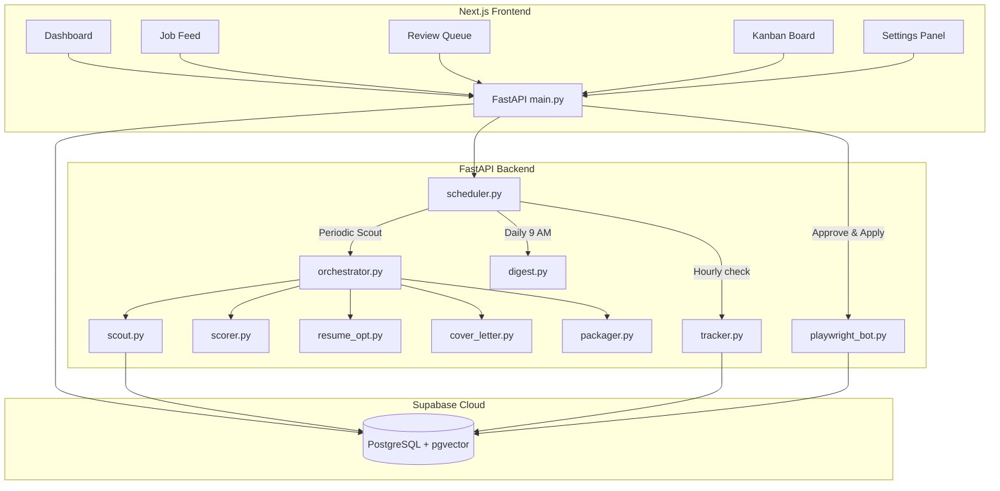

# AI Job Agent 🚀

AI Job Agent is an autonomous, agentic job search and application pipeline. It handles the end-to-end lifecycle of job hunting: from scraping job search engines and scoring matches against your resume, to tailoring resumes/cover letters, auto-submitting forms (with "Simplify Copilot" auto-filling), classifying recruiter emails, and updating a Kanban progress board.

---

## 🏗️ Architecture Overview



---

## ✨ Features

### 1. 🔍 Job Scout Agent
- Scrapes listings from multiple job sources:
  - **Adzuna API** (for direct developer positions).
  - **Internshala** (for junior and internship opportunities).
  - **Indeed** (using a headless Chromium Playwright browser with anti-detection and bypass timeouts).
- Auto-deduplicates listings via job URLs.

### 2. 📊 Semantic Match Scorer
- Generates **384-dimensional dense vector embeddings** locally for job descriptions using `sentence-transformers` (no external API calls needed).
- Calculates the **cosine similarity** between the job vector and your uploaded resume embedding.
- Connects to **Groq (Llama-3.3-70b)** to run qualitative analysis: extracts matched/missing skills, outputs custom justifications, and applies a smart score adjustment.

### 3. 📄 Resume & Cover Letter Tailoring
- **Resume Optimizer**: Customizes experience bullet points and technical skills to match keywords in the job description using Groq (without fabricating experience).
- **PDF Renderer**: Dynamically generates a clean, single-page, professional PDF using `reportlab`.
- **Cover Letter Agent**: Crafts a matching, highly-tailored 3-paragraph cover letter contextually fitted to the role.

### 4. 🤖 "Simplify Copilot" Auto-Submitter
- Automates form filling on **Greenhouse, Lever, Internshala**, and other career portals using async Playwright.
- **Form Autofill Engine**: Automatically detects and populates input profiles (GitHub, LinkedIn, Portfolio).
- **Legal & EEO Demographics**: Automatically maps and selects Equal Opportunity questions (gender, race, veteran status, and disability disclosures) based on user configuration.
- **Work Authorization**: Detects and answers sponsorship requirements and notice periods using smart text heuristics.

### 5. 📬 Gmail recruiter tracker
- Connects via **IMAP** to scan your inbox for status updates.
- Uses **Llama-3.3** classification to map incoming email bodies to active job applications and automatically transitions the Kanban status lanes (e.g. from `applied` to `interview` or `rejected`).

### 6. 📅 Daily Digest & Automation
- A background worker schedular runs scouting hourly and classifies incoming emails.
- Sends a dark-mode styled HTML summary email to your inbox at **9:00 AM** showing your dashboard counters, new matches found, and recent recruiter emails.

---

## 🛠️ Tech Stack

- **Backend**: FastAPI, Playwright (Python), BeautifulSoup4, ReportLab, Sentence-Transformers, Supabase-py, Groq SDK.
- **Frontend**: Next.js (App Router), React 19, TailwindCSS, Lucide Icons.
- **Database**: Supabase (PostgreSQL with `pgvector` extension for storing and querying resume/job embeddings).

---

## 🚀 Getting Started

### 1. Database Setup (Supabase)
1. Initialize a Supabase project.
2. In the **SQL Editor**, execute the migration files chronologically:
   - Run [20260611000000_init_schema.sql](file:///a:/AI Job Agent/supabase/migrations/20260611000000_init_schema.sql)
   - Run [20260611000100_add_settings.sql](file:///a:/AI Job Agent/supabase/migrations/20260611000100_add_settings.sql)
   - Run [20260611000200_add_copilot_fields.sql](file:///a:/AI Job Agent/supabase/migrations/20260611000200_add_copilot_fields.sql)

### 2. Backend Setup
1. Navigate to the backend directory:
   ```bash
   cd backend
   ```
2. Create your `.env` configuration file by duplicating the template:
   ```bash
   copy .env.example .env
   ```
3. Populate the keys in `.env`:
   - `SUPABASE_URL` & `SUPABASE_SERVICE_ROLE_KEY`
   - `GROQ_API_KEY`
   - `ADZUNA_APP_ID` & `ADZUNA_API_KEY` (optional)
4. Create a virtual environment and install dependencies:
   ```bash
   python -m venv venv
   venv\Scripts\activate
   pip install -r requirements.txt
   ```
5. Install Playwright browser dependencies:
   ```bash
   playwright install
   ```
6. Start the FastAPI development server:
   ```bash
   python -m uvicorn main:app --host 127.0.0.1 --port 8000
   ```

### 3. Frontend Setup
1. Navigate to the frontend directory:
   ```bash
   cd ../frontend
   ```
2. Install dependencies:
   ```bash
   npm install
   ```
3. Run the Next.js development server:
   ```bash
   npm run dev
   ```
4. Open your browser to `http://localhost:3000`.

---

## 🧪 Running Verification Tests

To verify both the Playwright copilot autofill and Indeed crawler locally, you can run the dry run scripts:

```bash
# Test the Simplify Copilot mapping logic on a mock EEO HTML page
python backend/tests/test_copilot_dry.py

# Test Indeed search scraping and card details extraction
python backend/tests/test_indeed_dry.py
```

---

## 🔒 Security Warning
Ensure you **never** commit your `.env` or `.env.local` files containing real API credentials or database connection strings. They are listed in the root `.gitignore` to stay safe.
