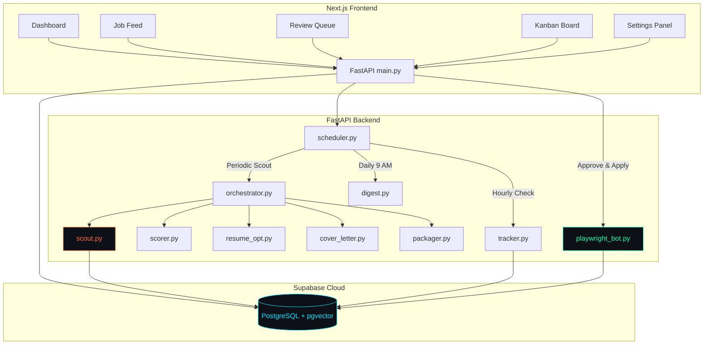

<div align="center">


<p align="center">
  
</p>


<br/><br/>

<a href="https://github.com/Rishabh02104/AI_Job_Agent"></a>
<a href="https://frontend-two-sigma-88.vercel.app/"></a>

</div>


---

## ⚙️ SYSTEM SPECIFICATIONS

**AI Job Agent** is an autonomous, agentic job search and application pipeline. It handles the end-to-end lifecycle of job hunting: from scraping job search engines and scoring matches against your resume, to tailoring resumes/cover letters, auto-submitting forms, classifying recruiter emails, and updating a Kanban progress board.

<div align="center">

| PARAMETER | DESCRIPTION / VALUE |
|:---|:---|
| 🤖 **AGENT TYPE** | End-to-End Autonomous Application Pipeline |
| 🧠 **AI CORE** | Groq (Llama-3.3-70b) + sentence-transformers (Local Embeddings) |
| 🕷️ **CRAWLER** | Async Playwright (Indeed, Adzuna, Internshala) |
| 📊 **VECTOR DATABASE** | Supabase (PostgreSQL with `pgvector` extension) |
| 📬 **GMAIL TRACKER** | IMAP integration + email classifier scheduler |
| 📅 **DAILY DIGEST** | HTML status summaries scheduled to send at 9:00 AM daily |

</div>


---

## 🛠️ SUBSYSTEM TECHNOLOGY MATRIX

<div align="center">

**`[ FRONTEND WORKSPACE ]`**


**`[ BACKEND & AGENTIC STACK ]`**


<br/>


</div>


---

## 🚀 PIPELINE ARCHITECTURE




---

## 🌟 CORE AGENT CAPABILITIES

### 1. 🔍 Job Scout Agent
- Scrapes listings from multiple job sources:
  - **Adzuna API** (for direct developer positions).
  - **Internshala** (for junior and internship opportunities).
  - **Indeed** (using a headless Chromium Playwright browser with anti-detection and bypass timeouts).
- Auto-deduplicates listings via job URLs.

### 2. 📊 Semantic Match Scorer
- Generates **384-dimensional dense vector embeddings** locally for job descriptions using `sentence-transformers` (no external API calls needed).
- Calculates the **cosine similarity** between the job vector and your uploaded resume embedding.
- Connects to **Groq (Llama-3.3-70b)** to run qualitative analysis: extracts matched/missing skills, outputs custom justifications, and applies a smart score adjustment.

### 3. 📄 Resume & Cover Letter Tailoring
- **Resume Optimizer**: Customizes experience bullet points and technical skills to match keywords in the job description using Groq (without fabricating experience).
- **PDF Renderer**: Dynamically generates a clean, single-page, professional PDF using `reportlab`.
- **Cover Letter Agent**: Crafts a matching, highly-tailored 3-paragraph cover letter contextually fitted to the role.

### 4. 🤖 "Simplify Copilot" Auto-Submitter & CAPTCHA Resolver
- Automates form filling on **Greenhouse, Lever, Internshala**, and other career portals using async Playwright.
- **Form Autofill Engine**: Automatically detects and populates input profiles (GitHub, LinkedIn, Portfolio).
- **Legal & EEO Demographics**: Automatically maps and selects Equal Opportunity questions (gender, race, veteran status, and disability disclosures) based on user configuration.
- **Work Authorization**: Detects and answers sponsorship requirements and notice periods using smart text heuristics.
- **Headed/Configurable Modes**: Toggle browser headed mode in settings (`run_headless = False`) to watch form-filling and manually solve CAPTCHAs in real-time.
- **On-Page Warning Banner**: Injects a floating red alert banner at the top of the browser page identifying the job and company requiring manual CAPTCHA interaction.
- **E2E Auto-Apply**: Toggle Auto-Apply in settings to automatically submit matching applications in the background without needing manual review board approval.

### 5. 📬 Gmail Recruiter Tracker
- Connects via **IMAP** to scan your inbox for status updates.
- Uses **Llama-3.3** classification to map incoming email bodies to active job applications and automatically transitions the Kanban status lanes (e.g. from `applied` to `interview` or `rejected`).

### 6. 📅 Daily Digest & Automation
- A background worker schedular runs scouting hourly and classifies incoming emails.
- Sends a dark-mode styled HTML summary email to your inbox at **9:00 AM** showing your dashboard counters, new matches found, and recent recruiter emails.


---

## 🚀 GETTING STARTED

### 1. Database Setup (Supabase)
1. Initialize a Supabase project.
2. In the **SQL Editor**, execute the migration files chronologically:
   - Run [20260611000000_init_schema.sql](file:///a:/AI%20Job%20Agent/supabase/migrations/20260611000000_init_schema.sql)
   - Run [20260611000100_add_settings.sql](file:///a:/AI%20Job%20Agent/supabase/migrations/20260611000100_add_settings.sql)
   - Run [20260611000200_add_copilot_fields.sql](file:///a:/AI%20Job%20Agent/supabase/migrations/20260611000200_add_copilot_fields.sql)

### 2. Backend Setup
1. Navigate to the backend directory:
   ```bash
   cd backend
   ```
2. Create your `.env` configuration file by duplicating the template:
   ```bash
   copy .env.example .env
   ```
3. Populate the keys in `.env`:
   - `SUPABASE_URL` & `SUPABASE_SERVICE_ROLE_KEY`
   - `GROQ_API_KEY`
   - `ADZUNA_APP_ID` & `ADZUNA_API_KEY` (optional)
4. Create a virtual environment and install dependencies:
   ```bash
   python -m venv venv
   venv\Scripts\activate
   pip install -r requirements.txt
   ```
5. Install Playwright browser dependencies:
   ```bash
   playwright install
   ```
6. Start the FastAPI development server:
   ```bash
   python -m uvicorn main:app --host 127.0.0.1 --port 8000
   ```

### 3. Frontend Setup
1. Navigate to the frontend directory:
   ```bash
   cd ../frontend
   ```
2. Install dependencies & launch:
   ```bash
   npm install
   npm run dev
   ```
3. Open your browser to `http://localhost:3000`.


---

## 🧪 RUNNING VERIFICATION TESTS

To verify both the Playwright copilot autofill, Indeed crawler, and CAPTCHA manual solving loop locally, you can run the dry run scripts:

```bash
# Test the Simplify Copilot mapping logic on a mock EEO HTML page
python backend/tests/test_copilot_dry.py

# Test Indeed search scraping and card details extraction
python backend/tests/test_indeed_dry.py

# Run the automated CAPTCHA manual solving loop dry run (headed browser, mock portal)
python backend/tests/test_captcha_dry.py
```


---

## 📬 SYSTEM CORE CONNECTION

```bash
╔══════════════════════════════════════════════════════════════════╗
║  [session_id]  :: rishavendrasharma9353@gmail.com               ║
║  [port]        :: 8000 — backend | 3000 — frontend              ║
║  [stack]       :: FastAPI · Playwright · Supabase · pgvector    ║
║  [uptime]      :: building since 2022 — no signs of stopping    ║
║  [last_commit] :: patch/scraping-anti-detection-bypass          ║
║  [status]      :: OPEN TO SDE-1 ROLES — immediate joiner        ║
╚══════════════════════════════════════════════════════════════════╝
```


